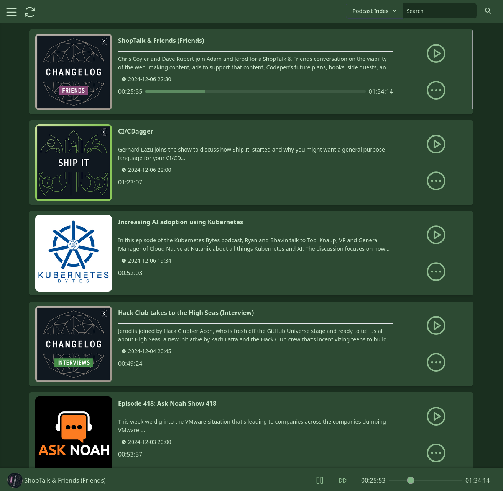
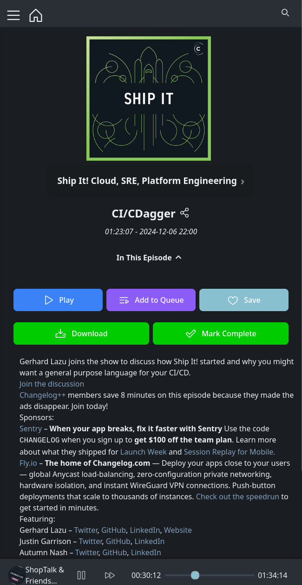

<p align="center">
  
</p>

# PinePods :evergreen_tree:
[](https://discord.gg/bKzHRa4GNc)
[](https://matrix.to/#/#pinepods:matrix.org)
[](https://github.com/madeofpendletonwool/PinePods/actions)
[](https://github.com/madeofpendletonwool/PinePods/releases)

---

- [PinePods :evergreen\_tree:](#pinepods-evergreen_tree)
- [Getting Started](#getting-started)
  - [Features](#features)
  - [Try it out! :zap:](#try-it-out-zap)
  - [Installing :runner:](#installing-runner)
    - [Server Installation :floppy\_disk:](#server-installation-floppy_disk)
      - [Compose File](#compose-file)
      - [Admin User Info](#admin-user-info)
      - [Proxy Info](#proxy-info)
      - [Note on the Search API](#note-on-the-search-api)
      - [Timezone Configuration](#timezone-configuration)
      - [Client API Vars](#client-api-vars)
      - [Start it up!](#start-it-up)
    - [Linux Client Install :computer:](#linux-client-install-computer)
    - [Windows Client Install :computer:](#windows-client-install-computer)
    - [Mac Client Install :computer:](#mac-client-install-computer)
    - [Android Install :iphone:](#android-install-iphone)
    - [ios Install :iphone:](#ios-install-iphone)
  - [PodPeople DB](#podpeople-db)
  - [Pinepods Firewood](#pinepods-firewood)
  - [Platform Availability](#platform-availability)
  - [ToDo](#todo)
  - [Screenshots :camera:](#screenshots-camera)

# Getting Started

PinePods is a Rust based podcast management system that manages podcasts with multi-user support and relies on a central database with clients to connect to it. It's browser based and your podcasts and settings follow you from device to device due to everything being stored on the server. You can subscribe to podcasts and even hosts for podcasts with the help of the PodPeopleDB. It works on mobile devices and can also sync with a Nextcloud server or gpodder compatible sync server so you can use external apps like Antennapod as well!

For more information than what's provided in this repo visit the [documentation site](https://www.pinepods.online/).

<p align="center">
  
</p>

## Features

Pinepods is a complete podcast management system and allows you to play, download, and keep track of podcasts you (or any of your users) enjoy. It allows for searching and subscribing to hosts and podcasts using The Podcast Index or Itunes and provides a modern looking UI to browse through shows and episodes. In addition, Pinepods provides simple user management and can be used by multiple users at once using a browser or app version. Everything is saved into a MySQL or Postgres database including user settings, podcasts and episodes. It's fully self-hosted, open-sourced, and I provide an option to use a hosted search API or you can also get one from the Podcast Index and use your own. There's even many different themes to choose from! Everything is fully dockerized and I provide a simple guide found below explaining how to install and run Pinepods on your own system.

## Try it out! :zap:

I maintain an instance of Pinepods that's publicly accessible for testing over at [try.pinepods.online](https://try.pinepods.online). Feel free to make an account there and try it out before making your own server instance. This is not intended as a permanent method of using Pinepods and it's expected you run your own server; accounts will often be deleted from there.

## Installing :runner:

There's potentially a few steps to getting Pinepods fully installed. After you get your server up and running fully you can also install the client editions of your choice. The server install of Pinepods runs a server and a browser client over a port of your choice in order to be accessible on the web. With the client installs you simply give the client your server url to connect to the database and then sign in.

### Server Installation :floppy_disk:

First, the server. You have multiple options for deploying Pinepods:

  - [Using Docker Compose :whale:](#docker-compose)
  - [Using Helm for Kubernetes :anchor:](#helm-deployment)

You can also choose to use MySQL/MariaDB or Postgres as your database. Examples for both are provided below.

### Docker Compose
#### User Permissions
Pinepods can run with specific user permissions to ensure downloaded files are accessible on the host system. This is controlled through two environment variables:
- `PUID`: Process User ID (defaults to 1000 if not set)
- `PGID`: Process Group ID (defaults to 1000 if not set)

To find your user's UID and GID, run:
```bash
id -u   # Your UID
id -g   # Your GID
```

#### Compose File - PostgreSQL (Recommended)
```yaml
services:
  db:
    container_name: db
    image: postgres:latest
    environment:
      POSTGRES_DB: pinepods_database
      POSTGRES_USER: postgres
      POSTGRES_PASSWORD: myS3curepass
      PGDATA: /var/lib/postgresql/data/pgdata
    volumes:
      - /home/user/pinepods/pgdata:/var/lib/postgresql/data
    ports:
      - "5432:5432"
    restart: always

  valkey:
    image: valkey/valkey:8-alpine
    ports:
      - "6379:6379"

  pinepods:
    image: madeofpendletonwool/pinepods:latest
    ports:
      - "8040:8040"
    environment:
      # Basic Server Info
      SEARCH_API_URL: 'https://search.pinepods.online/api/search'
      PEOPLE_API_URL: 'https://people.pinepods.online'
      HOSTNAME: 'http://localhost:8040'
      # Database Vars
      DB_TYPE: postgresql
      DB_HOST: db
      DB_PORT: 5432
      DB_USER: postgres
      DB_PASSWORD: myS3curepass
      DB_NAME: pinepods_database
      # Valkey Settings
      VALKEY_HOST: valkey
      VALKEY_PORT: 6379
      # Enable or Disable Debug Mode for additional Printing
      DEBUG_MODE: false
      PUID: ${UID:-911}
      PGID: ${GID:-911}
      # Add timezone configuration
      TZ: "America/New_York"
    volumes:
      # Mount the download and backup locations on the server
      - /home/user/pinepods/downloads:/opt/pinepods/downloads
      - /home/user/pinepods/backups:/opt/pinepods/backups
      # Timezone volumes, HIGHLY optional. Read the timezone notes below
      - /etc/localtime:/etc/localtime:ro
      - /etc/timezone:/etc/timezone:ro
    depends_on:
      - db
      - valkey
```

#### Compose File - MariaDB (Alternative)
```yaml
services:
  db:
    container_name: db
    image: mariadb:latest
    command: --wait_timeout=1800
    environment:
      MYSQL_TCP_PORT: 3306
      MYSQL_ROOT_PASSWORD: myS3curepass
      MYSQL_DATABASE: pinepods_database
      MYSQL_COLLATION_SERVER: utf8mb4_unicode_ci
      MYSQL_CHARACTER_SET_SERVER: utf8mb4
      MYSQL_INIT_CONNECT: 'SET @@GLOBAL.max_allowed_packet=64*1024*1024;'
    volumes:
      - /home/user/pinepods/sql:/var/lib/mysql
    ports:
      - "3306:3306"
    restart: always

  valkey:
    image: valkey/valkey:8-alpine
    ports:
      - "6379:6379"

  pinepods:
    image: madeofpendletonwool/pinepods:latest
    ports:
      - "8040:8040"
    environment:
      # Basic Server Info
      SEARCH_API_URL: 'https://search.pinepods.online/api/search'
      PEOPLE_API_URL: 'https://people.pinepods.online'
      HOSTNAME: 'http://localhost:8040'
      # Database Vars
      DB_TYPE: mariadb
      DB_HOST: db
      DB_PORT: 3306
      DB_USER: root
      DB_PASSWORD: myS3curepass
      DB_NAME: pinepods_database
      # Valkey Settings
      VALKEY_HOST: valkey
      VALKEY_PORT: 6379
      # Enable or Disable Debug Mode for additional Printing
      DEBUG_MODE: false
      PUID: ${UID:-911}
      PGID: ${GID:-911}
      # Add timezone configuration
      TZ: "America/New_York"

    volumes:
      # Mount the download and backup locations on the server
      - /home/user/pinepods/downloads:/opt/pinepods/downloads
      - /home/user/pinepods/backups:/opt/pinepods/backups
      # Timezone volumes, HIGHLY optional. Read the timezone notes below
      - /etc/localtime:/etc/localtime:ro
      - /etc/timezone:/etc/timezone:ro
    depends_on:
      - db
      - valkey
```

Make sure you change these variables to variables specific to yourself at a minimum.

```
      # The url you hit the site at. Only used for sharing rss feeds
      HOSTNAME: 'http://localhost:8040'
      # These next 4 are optional. They allow you to set an admin without setting on the first boot
      USERNAME: pinepods
      PASSWORD: password
      FULLNAME: John Pinepods
      EMAIL: john@pinepods.com
      # DB vars should match your values for the db you set up above
      DB_TYPE: postgresql
      DB_HOST: db
      DB_PORT: 5432
      DB_USER: postgres
      DB_PASSWORD: myS3curepass
      DB_NAME: pinepods_database
```

Most of those are pretty obvious, but let's break a couple of them down.

#### Admin User Info

First of all, the USERNAME, PASSWORD, FULLNAME, and EMAIL vars are your details for your default admin account. This account will have admin credentails and will be able to log in right when you start up the app. Once started you'll be able to create more users and even more admins but you need an account to kick things off on. If you don't specify credentials in the compose file it will create an account with a random password for you but I would recommend just creating one for yourself.


#### Note on the Search API

Let's talk quickly about the searching API. This allows you to search for new podcasts and it queries either itunes or the podcast index for new podcasts. The podcast index requires an api key while itunes does not. If you'd rather not mess with the api at all simply set the API_URL to the one below.

```
SEARCH_API_URL: 'https://search.pinepods.online/api/search'
```

Above is an api that I maintain. I do not guarantee 100% uptime on this api though, it should be up most of the time besides a random internet or power outage here or there. A better idea though, and what I would honestly recommend is to maintain your own api. It's super easy. Check out the API docs for more information on doing this. Link Below -

https://www.pinepods.online/docs/API/search_api

#### Timezone Configuration

PinePods supports displaying timestamps in your local timezone instead of UTC. This helps improve readability and prevents confusion when viewing timestamps such as "last sync" times in the gpodder API. Note that this configuration is specifically for logs. Each user sets their own timezone settings on first login. That is seperate from this server timezone config.

##### Setting the Timezone

You have two main options for configuring the timezone in PinePods:

##### Option 1: Using the TZ Environment Variable (Recommended)

Add the `TZ` environment variable to your docker-compose.yml file:

```yaml
services:
  pinepods:
    image: madeofpendletonwool/pinepods:latest
    environment:
      # Other environment variables...
      TZ: "America/Chicago"  # Set your preferred timezone
```

This method works consistently across all operating systems (Linux, macOS, Windows) and is the recommended approach.

##### Option 2: Mounting Host Timezone Files (Linux Only)

On Linux systems, you can mount the host's timezone files:

```yaml
services:
  pinepods:
    image: madeofpendletonwool/pinepods:latest
    volumes:
      # Other volumes...
      - /etc/localtime:/etc/localtime:ro
      - /etc/timezone:/etc/timezone:ro
```

**Note**: This method only works reliably on Linux hosts. For macOS and Windows users, please use the TZ environment variable (Option 1).

##### Priority

If both methods are used:
1. The TZ environment variable takes precedence
2. Mounted timezone files are used as a fallback

##### Common Timezone Values

Here are some common timezone identifiers:
- `America/New_York` - Eastern Time
- `America/Chicago` - Central Time
- `America/Denver` - Mountain Time
- `America/Los_Angeles` - Pacific Time
- `Europe/London` - United Kingdom
- `Europe/Berlin` - Central Europe
- `Asia/Tokyo` - Japan
- `Australia/Sydney` - Australia Eastern

For a complete list of valid timezone identifiers, see the [IANA Time Zone Database](https://www.iana.org/time-zones).

##### Troubleshooting Timezones

- I'm on macOS and timezone settings aren't working

macOS uses a different timezone file format than Linux. You must use the TZ environment variable method on macOS.


#### Start it up!

Either way, once you have everything all setup and your compose file created go ahead and run

```
sudo docker-compose up
```

To pull the container images and get started. Once fully started up you'll be able to access pinepods at the port you configured and you'll be able to start connecting clients as well.


### Helm Deployment

Alternatively, you can deploy Pinepods using Helm on a Kubernetes cluster. Helm is a package manager for Kubernetes that simplifies deployment.

#### Adding the Helm Repository

First, add the Pinepods Helm repository:

```bash
helm repo add pinepods http://helm.pinepods.online
helm repo update
```

#### Installing the Chart

To install the Pinepods Helm chart with default values:

```bash
helm install pinepods pinepods/pinepods --namespace pinepods-namespace --create-namespace
```

Or with custom values:

```bash
helm install pinepods pinepods/pinepods -f my-values.yaml --namespace pinepods-namespace --create-namespace
```

#### Configuration Options

The Helm chart supports extensive configuration. Key areas include:

**Main Application:**
- Image repository and tag configuration
- Service type and port settings
- Ingress configuration with TLS support
- Persistent storage for downloads and backups
- Resource limits and requests
- Security contexts and pod placement

**Dependencies:**
- PostgreSQL database (can be disabled for external database)
- Valkey/Redis for caching (can be disabled)
- Optional backend API deployment for self-hosted search
- Optional PodPeople database for podcast host information

**Example values.yaml:**

```yaml
# Main application configuration
image:
  repository: madeofpendletonwool/pinepods
  tag: latest
  pullPolicy: IfNotPresent

service:
  type: ClusterIP
  port: 8040

ingress:
  enabled: true
  className: ""
  annotations:
    traefik.ingress.kubernetes.io/router.entrypoints: web
  hosts:
    - host: pinepods.example.com
      paths:
        - path: /
          pathType: Prefix
  tls: []

# Persistent storage
persistence:
  enabled: true
  downloads:
    storageClass: ""  # Use default storage class
    size: 5Gi
  backups:
    storageClass: ""
    size: 2Gi

# Database configuration
postgresql:
  enabled: true
  auth:
    username: postgres
    password: "changeme"
    database: pinepods_database
  persistence:
    enabled: true
    size: 3Gi

# Valkey/Redis configuration
valkey:
  enabled: true
  architecture: standalone
  auth:
    enabled: false

# Optional backend API (self-hosted search)
backend:
  enabled: false
  secrets:
    apiKey: "YOUR_PODCAST_INDEX_KEY"
    apiSecret: "YOUR_PODCAST_INDEX_SECRET"

# Optional PodPeople database
podpeople:
  enabled: false

# Application environment
env:
  USERNAME: "admin"
  PASSWORD: "password"
  FULLNAME: "Admin User"
  EMAIL: "admin@example.com"
  DEBUG_MODE: "false"
  HOSTNAME: 'http://localhost:8040'
```

#### External Database Configuration

To use an external database instead of the included PostgreSQL:

```yaml
postgresql:
  enabled: false

externalDatabase:
  host: "your-postgres-host"
  port: 5432
  user: postgres
  password: "your-password"
  database: pinepods_database
```
    size: 3Gi

valkey:
  enabled: true
  architecture: standalone
  auth:
    enabled: false
  replica:
    replicaCount: 0
  primary:
    persistence:
      enabled: false
  service:
    port: 6379

env:
  SEARCH_API_URL: "https://search.pinepods.online/api/search"
  PEOPLE_API_URL: "https://people.pinepods.online"
  USERNAME: "admin"
  PASSWORD: "password"
  FULLNAME: "Admin User"
  EMAIL: "admin@example.com"
  HOSTNAME: 'http://localhost:8040'
  DB_TYPE: "postgresql"
  DB_USER: "postgres"
  DB_NAME: "pinepods_database"
  DB_PORT: "5432"
  DEBUG_MODE: "false"

# Backend and Podpeople can be disabled (set to false) if you plan to use the ones I maintain.
# To do that set to false and simply keep the SEARCH_API_URL and PEOPLE_API_URL above as their defaults
backend:
  enabled: true
  image:
    repository: madeofpendletonwool/pinepods_backend
    tag: latest
    pullPolicy: Always
  service:
    type: ClusterIP
    port: 5000
  secrets:
    apiKey: "YOUR_PODCAST_INDEX_KEY"
    apiSecret: "YOUR_PODCAST_INDEX_SECRET"
# This ingress is specific to pinepods backend. If you don't use that change to disabled.
  ingress:
    enabled: true
    className: ""
    annotations:
      # Whatever you need to set here
    hosts:
      - host: backend.example.com
        paths:
          - path: /
            pathType: Prefix

podpeople:
  enabled: true
  image:
    repository: madeofpendletonwool/podpeople_db
    tag: latest
    pullPolicy: Always
  service:
    type: ClusterIP
    port: 8085
  persistence:
    enabled: true
    storageClass: ""
    size: 1Gi
    accessMode: ReadWriteOnce
  auth:
    adminUsername: "admin"
    adminPassword: "password"
  environment:
    ntfyUrl: "https://ntfy.sh"
    ntfyTopic: "your-topic"
    searchApiUrl: "http://pinepods-backend:5000"
    baseurl: "https://podpeople.example.com"
# This ingress is specific to podpeople db. If you don't use that change to disabled.
  ingress:
    enabled: true
    className: ""
    annotations:
      # Whatever you need to set here
    hosts:
      - host: podpeople.example.com
        paths:
          - path: /
            pathType: Prefix
```

#### Create a namespace for Pinepods:

Create a namespace to hold the deployment:
```
kubectl create namespace pinepods-namespace
```

#### Starting Helm

Once you have everything set up, install the Helm chart:
```
helm install pinepods pinepods/Pinepods -f my-values.yaml
```
This will deploy Pinepods on your Kubernetes cluster with a postgres database. MySQL/MariaDB is not supported with the kubernetes setup. The service will be accessible at the specified NodePort.

Check out the Tutorials on the documentation site for more information on how to do basic things.

https://pinepods.online/tutorial-basic/sign-in-homescreen.md

## Client Installs

Any of the client additions are super easy to get going.

### Linux Client Installs :computer:

#### AppImage, Fedora/Red Hat Derivative/Debian based (Ubuntu)

First head over to the releases page on Github

https://github.com/madeofpendletonwool/PinePods/releases

Grab the latest linux release. There's both an appimage a deb, and an rpm. Use the appimage of course if you aren't using a debian or red hat based distro. Change the permissions if using the appimage version to allow it to run.

```
sudo chmod +x pinepods.appimage
```

^ The name of the app file will vary slightly based on the version so be sure you change it or it won't work.

For the rpm or deb version just run and install

Once started you'll be able to sign in with your username and password. The server name is simply the url you browse to to access the server.

#### Arch Linux (AUR)

Install the Pinepods Client right from the AUR! Replace the command below with your favorite aur helper

```
paru -S pinepods
```

#### Flatpak

You can search for Pinepods in your favorite flatpak installer gui app such as Gnome Software.

Flathub page can be found [here](https://flathub.org/apps/com.gooseberrydevelopment.pinepods)

```
flatpak install flathub com.gooseberrydevelopment.pinepods
```

#### Snap

I have had such a nightmare trying to make the snap client work. Pass, use the flatpak. They're better anyway. I'll test it again in the future and see if Cannonical has gotten it together. If you really want a snap version of the client please reach out and tell me you're interested in the first place

#### Windows Client Install :computer:

Any of the client additions are super easy to get going. First head over to the releases page on Github

https://github.com/madeofpendletonwool/PinePods/releases

There's a exe and msi windows install file.

The exe will actually start an install window and allow you to properly install the program to your computer.

The msi will simply run a portable version of the app.

Either one does the same thing ultimately and will work just fine.

Once started you'll be able to sign in with your username and password. The server name is simply the url you browse to to access the server.

#### Mac Client Install :computer:

Any of the client additions are super easy to get going. First head over to the releases page on Github

https://github.com/madeofpendletonwool/PinePods/releases

There's a dmg and pinepods_mac file.

Simply extract, and then go into Contents/MacOS. From there you can run the app.

The dmg file will prompt you to install the Pinepods client into your applications fileter while the _mac file will just run a portable version of the app.

Once started you'll be able to sign in with your username and password. The server name is simply the url you browse to to access the server.

#### Android Install :iphone:

For now, it's a manual install and there are some issues with the app. Check the releases page for the latest apk.

#### ios Install :iphone:

Coming Soon - The web app works great for phones.

## PodPeople DB

Podpeople DB is a project that I maintain and also develop. Podpeople DB is a way to suppliment Person tags for podcasts that don't support them by default. This allows the community to maintain hosts and follow them to all podcasts! I maintain an instance of Podpeople DB at podpeopledb.com. Otherwise, it's an open source project and you can maintain and instance of your own if you prefer. For information on that go [here](https://podpeopledb.com/docs/self-host). You can download the database yourself and maintain your own instance. If you do decide to go this route please still add any hosts for your favorite podcasts at the instance hosted at podpeopledb.com. The community will thank you!

For additional info on Podpeople DB check out [the docs](https://podpeopledb.com/docs/what-is-this-for).

Additionally, I've written [a blog](https://www.pinepods.online/blog) post discussing the rational around it's creation.

Finally, you can check out the Repo for it [here!](https://github.com/madeofpendletonwool/podpeople-db)

## Pinepods Firewood

A CLI only client that can be used to remotely share your podcasts to is in the works! Check out [Pinepods Firewood!](https://github.com/madeofpendletonwool/pinepods-firewood)

## Platform Availability

The Intention is for this app to become available on Windows, Linux, Mac, Android, and IOS. Windows, Linux, Mac, web, and android are all currently available and working. The android app is in a sort of beta currently as I finalize any remaining issues with it. Track those [here](https://github.com/madeofpendletonwool/PinePods/issues/320). This app is built with Tauri, therefore once the Android version is in a final state there's no reason I can't just compile it to ios as well.

For a podcast sync app I recommend Opodsync, but nextcloud sync works great too! This is only required if you use an app like AntennaPods. So then your Pinepods and Antennapods sync up podcasts.

[OpodSync](https://github.com/kd2org/opodsync)

[Nextcloud Podcast Sync App](https://apps.nextcloud.com/apps/gpoddersync)

ARM devices are also supported including raspberry pis. The app is shockingly performant on a raspberry pi as well. The only limitation is that a 64bit OS is required on an arm device. Setup is exactly the same, just use the latest tag and docker will auto pull the arm version.

## ToDo

For a list of ToDo's check out the [Road to 1.0](https://github.com/madeofpendletonwool/PinePods/issues/397) issue. Updates and progress can be seen there:

### Clients to support

- [x] Flatpak Package
- [ ] Nix Package
- [x] Aur Package
- [x] Snap package
- [x] Helm Chart and repo for kubernetes deployment
- [ ] Mobile Apps
  - [x] Android App - Beta
    - [ ] Android Auto support
  - [ ] IOS App
  - [ ] Packaging and automation

## Long term goals

- [ ] Podcast ad blocking. Either by parsing audio blocks with ai and filtering ads or by utilizing a centralized server to allow others to send their ad block info to after determining the timestamps for ads.


## Screenshots :camera:

Main Homepage with podcasts displayed
<p align="center">
  
</p>

Loads of themes!
<p align="center">
  
</p>
<p align="center">
  
</p>
<p align="center">
  
</p>

Full Podcast Management
<p align="center">
  
</p>

Browse through episodes
<p align="center">
  
</p>

Markdown and HTML display compatible
<p align="center">
  
</p>

Mobile support baked right in!
<p align="center">
  
</p>
<p align="center">
  
</p>


#### Runners

Arm Images made possible by Runs-On:
https://runs-on.com

#### 📜 Credits & Licensing

PinePods is an open-source podcast player developed by Gooseberry Development, licensed under the GNU General Public License v3.0 (GPL-3.0).

The Pinepods Mobile app in the mobile directory includes code adapted from the excellent [Anytime Podcast Player](https://github.com/amugofjava/anytime_podcast_player), originally created by Ben Hills.
🧩 Included Third-Party Code

    Anytime Podcast Player
    © 2020 Ben Hills and project contributors
    Licensed under the BSD 3-Clause License

Portions of the mobile app retain the original BSD license and attribution as required. Files with this license are labeled at the top to clearly indicate. See the LICENSE.ben_hills in the mobile directory for details.

#### 💬 Acknowledgment

Huge thanks to Ben Hills for open-sourcing the Anytime Podcast Player. It served as a solid foundation and greatly accelerated development of PinePods.
