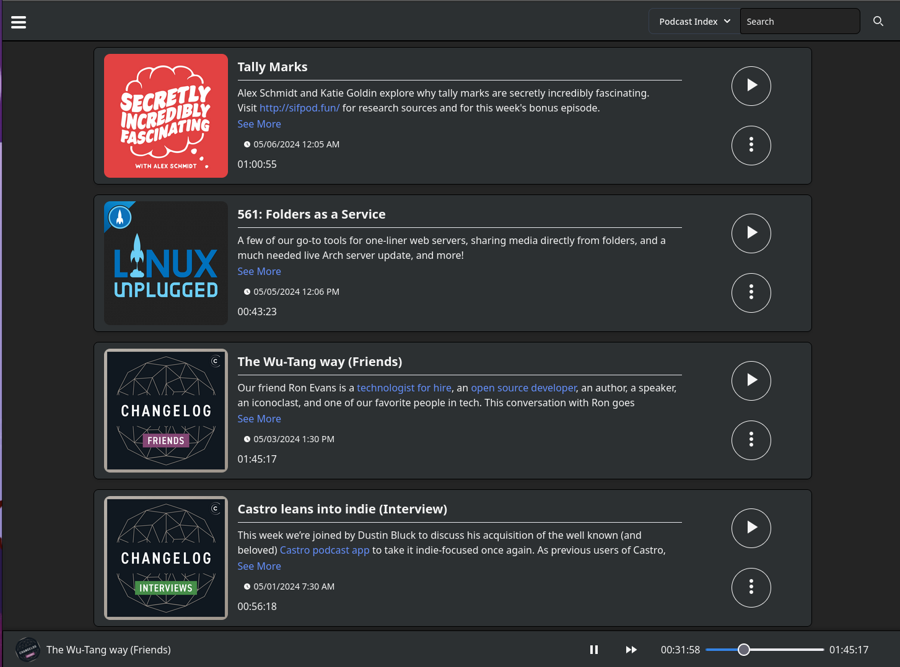
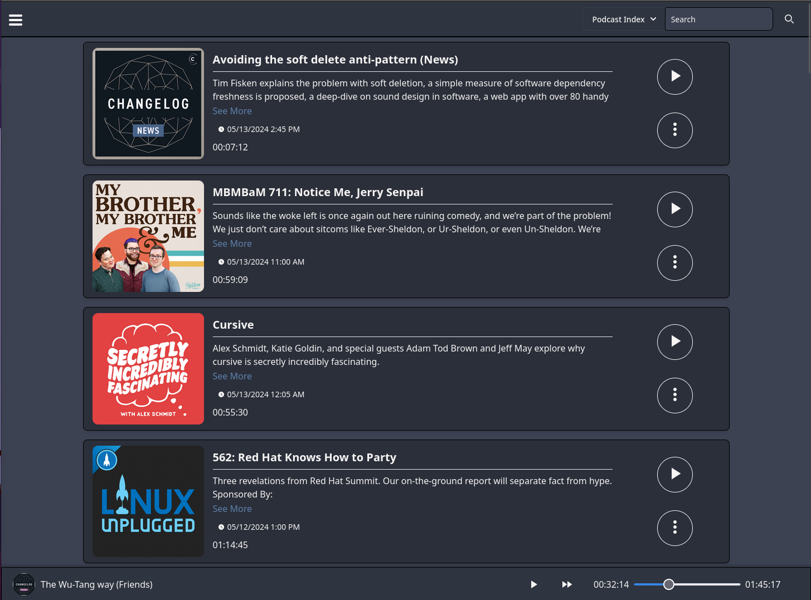
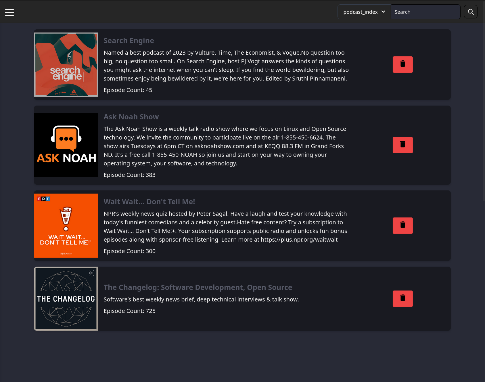
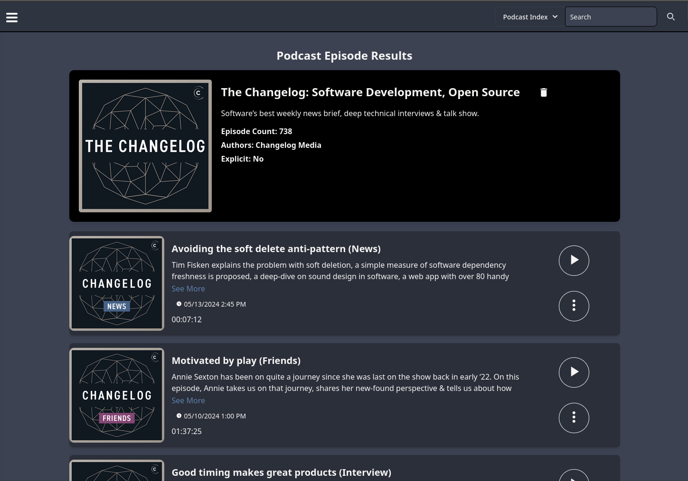
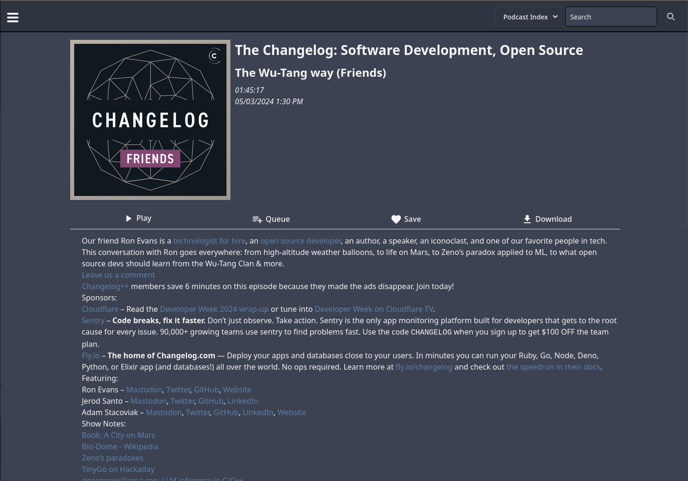

<p align="center">
  
</p>


# PinePods :evergreen_tree:

[](https://discord.gg/bKzHRa4GNc)

- [PinePods :evergreen\_tree:](#pinepods-evergreen_tree)
- [Getting Started](#getting-started)
  - [Features](#features)
  - [Try it out! :zap:](#try-it-out-zap)
  - [Installing :runner:](#installing-runner)
    - [Server Installation :floppy\_disk:](#server-installation-floppy_disk)
      - [Compose File](#compose-file)
      - [Admin User Info](#admin-user-info)
      - [Proxy Info](#proxy-info)
      - [Note on the Search API](#note-on-the-search-api)
      - [Client API Vars](#client-api-vars)
      - [Start it up!](#start-it-up)
    - [Linux Client Install :computer:](#linux-client-install-computer)
    - [Windows Client Install :computer:](#windows-client-install-computer)
    - [Mac Client Install :computer:](#mac-client-install-computer)
    - [Android Install :iphone:](#android-install-iphone)
    - [ios Install :iphone:](#ios-install-iphone)
  - [Platform Availability](#platform-availability)
  - [ToDo (Listed in order they will be implemented)](#todo-listed-in-order-they-will-be-implemented)
  - [Screenshots :camera:](#screenshots-camera)

# Getting Started

PinePods is a Python based app that can sync podcasts for individual accounts that relies on a central database with a web frontend and apps available on multiple platforms

## Features

Pinepods is a complete podcasts management system and allows you to play, download, and keep track of podcasts you enjoy. It allows for searching new podcasts using The Podcast Index and provides a modern looking UI to browse through shows and episodes. In addition, Pinepods provides simple user managment and can be used by multiple users at once using a browser or app version. Everything is saved into a Mysql database including user settings, podcasts and episodes. It's fully self-hosted, and I provide an option to use a hosted API or you can also get one from the podcast API and use your own. There's even many different themes to choose from! Everything is fully dockerized and I provide a simple guide found below explaining how to install Pinepods on your own system.

## Try it out! :zap:

I try and maintain an instance of Pinepods that's publicly accessible for testing over at [try.pinepods.online](https://try.pinepods.online). Feel free to make an account there and try it out before making your own server instance. This is not intended as a permanant method of using Pinepods and it's expected you run your own server so accounts will often be deleted from there.

## Installing :runner:

There's potentially a few steps to getting Pinepods fully installed as after you get your server up and running fully. You can also install the client editions of your choice. The server install of Pinepods runs a server and a browser client over a port of your choice in order to be accessible on the web. With the client installs you simply give your install a specific url to connect to the database and then sign in.

### Server Installation :floppy_disk:

First, the server. It's hightly recommended you run the server using docker compose. Here's the docker compose yaml needed.

#### Compose File

```
version: '3'
services:
  db:
    image: mariadb:latest
    command: --wait_timeout=1800
    environment:
      MYSQL_TCP_PORT: 3306
      MYSQL_ROOT_PASSWORD: myS3curepass
      MYSQL_DATABASE: pypods_database
      MYSQL_COLLATION_SERVER: utf8mb4_unicode_ci
      MYSQL_CHARACTER_SET_SERVER: utf8mb4
      MYSQL_INIT_CONNECT: 'SET @@GLOBAL.max_allowed_packet=64*1024*1024;'
    volumes:
      - /home/user/pinepods/sql:/var/lib/mysql
    ports:
      - "3306:3306"
    restart: always
  pinepods:
    image: madeofpendletonwool/pinepods:latest
    ports:
    # Web Portal Port
      - "8034:8034"
    # API Server Port - Needed for Client Connections
      - "8032:8032"
    # Image Proxy Port - Needed to Display Some Images
      - "8000:8000"
    environment:
      # Basic Server Info
      HOSTNAME: try.pinepods.online
      API_SERVER_PORT: 8032
      SEARCH_API_URL: 'https://search.pinepods.online/api/search'
      # Default Admin User Information
      USERNAME: myadminuser01
      PASSWORD: myS3curepass
      FULLNAME: Pinepods Admin
      EMAIL: user@pinepods.online
      # Database Vars
      DB_TYPE: mysql
      DB_HOST: db
      DB_PORT: 3306
      DB_USER: root
      DB_PASSWORD: myS3curepass
      DB_NAME: pypods_database
      # Image/Audio Proxy Vars
      PROXY_PORT: 8000
      PROXY_PROTOCOL: https
      REVERSE_PROXY: "True"
    volumes:
    # Mount the download and the backup location on the server if you want to. You could mount a nas to the downloads folder or something like that. 
    # The backups directory is used if backups are made on the web version on pinepods. When taking backups on the client version it downloads them locally.
      - /home/user/pinepods/downloads:/opt/pinepods/downloads
      - /home/user/pinepods/backups:/opt/pinepods/backups
    depends_on:
      - db
```

Make sure you change these variables to variables specific to yourself.

```
      MYSQL_ROOT_PASSWORD: password
      HOSTNAME: try.pinepods.online
      SEARCH_API_URL: 'https://search.pinepods.online/api/search'
      USERNAME: pinepods
      PASSWORD: password
      FULLNAME: John Pinepods
      EMAIL: john@pinepods.com
      DB_PASSWORD: password # This should match the MSQL_ROOT_PASSWORD
      PROXY_PORT: 8033
      PROXY_PROTOCOL: http
      REVERSE_PROXY: "True"
```

Most of those are pretty obvious, but let's break a couple of them down.

#### Admin User Info

First of all, the USERNAME, PASSWORD, FULLNAME, and EMAIL vars are your details for your default admin account. This account will have admin credentails and will be able to log in right when you start up the app. Once started you'll be able to create more users and even more admins but you need an account to kick things off on. If you don't specify credentials in the compose file it will create an account with a random password for you but I would recommend just creating one for yourself.

#### Basic Info

The HOSTNAME variable is simply the hostname you'll be using for the name of your pinepods server. There's a image proxy, fastapi server, and web client of pinepods that all runs over this hostname.

#### Proxy Info

Second, the PROXY_PORT, PROXY_PROTOCOL, and REVERSE_PROXY vars. Pinepods uses a proxy to route both images and audio files in order to prevent CORs issues in the app (Essentially so podcast images and audio displays correctly and securely). It runs a little internal Flask app to accomplish this. That's the Image/Audio Proxy Vars portion of the compose file. The application itself will then use this proxy to route media though. This proxy can also be ran over a reverse proxy. Here's few examples

**Recommended:**
Routed through proxy, secure, with reverse proxy

```
      HOSTNAME: try.pinepods.online
      PROXY_PORT: 8033
      PROXY_PROTOCOL: https
      REVERSE_PROXY: "True"
```

*Note*: With reverse proxies you create a second proxy host. So for example my Pinepods instance itself runs at port 8034 at pinpods.online so my reverse proxy reflects that and I have a dns record for the domain created for pinepods.online to point to my public ip. In addition, my proxy is ran at port 8033 over domain proxy.pinepods.online. I created a seperate dns record for this pointed to my public ip.

*Also Note*: If you run pinepods over reverse proxy to secure it you **must** run the proxy server over reverse proxy as well to prevent mixed content in the browser

Direct to ip, insecure, and no reverse proxy

```
      HOSTNAME: 192.168.0.30
      PROXY_PORT: 8033
      PROXY_PROTOCOL: http
      REVERSE_PROXY: "False"
```

Hostname, secure, and no reverse proxy

```
      HOSTNAME: proxy.pinepods.online
      PROXY_PORT: 8033
      PROXY_PROTOCOL: https
      REVERSE_PROXY: "False"
```

Note: Changing REVERSE_PROXY to False adjusts what the application uses for the reverse proxy. In short, it removes the port from the url it uses for routing since the reverse proxy will add the port for you.

So REVERSE_PROXY "True" - App will use
https://proxy.pinepods.online

REVERSE_PROXY "False" - App will use
https://proxy.pinepods.online:8033

#### Further note on Reverse Proxies

Pinepods has a bit of additional reverse proxy setup since it runs the fastapi server, web client, and image proxy. Please see the website for additional documentation on setting that up. You simply need to add some additional locations.
https://www.pinepods.online/docs/tutorial-extras/reverse-proxy

#### Note on the Search API

Let's talk quickly about the searching API. This allows you to search for new podcasts and it queries either itunes or the podcast index for new podcasts. The podcast index requires an api key while itunes does not. If you'd rather not mess with the api at all simply set the API_URL to the one below.

```
API_URL: 'https://api.pinepods.online/api/search'
```

Above is an api that I maintain. I do not guarantee 100% uptime on this api though, it should be up most of the time besides a random internet or power outage here or there. A better idea though, and what I would honestly recommend is to maintain your own api. It's super easy. Check out the API docs for more information on doing this. Link Below -

https://www.pinepods.online/docs/API/search_api

####  Client API Vars

The Client API server port variable tells Pinepods what port to expose the FastAPI routes on. This is needed to connect to the server with the Pinepods client/app version. The API_SERVER_PORT variable and API server port that is exposed in the compose file need to be the same.
```
# API Server Port - Needed for Client Connections
  - "8032:8032"
...
API_SERVER_PORT: 8032
```
#### Start it up!

Either way, once you have everything all setup and your compose file created go ahead and run your

```
sudo docker-compose up
```

command on the main pinepods app to pull the container images and get started. Once fully started up you'll be able to access pinepods on the url you configured and you'll be able to start connecting clients as well once you get an API from the settings area in the web app. Check out the Tutorials on the documentation site for more information on how to do basic things.

https://pinepods.online/tutorial-basic/sign-in-homescreen.md

### Linux Client Install :computer:

Any of the client additions are super easy to get going. First head over to the releases page on Github

https://github.com/madeofpendletonwool/PinePods/releases

Grab the pinepods.tar file from the newest release. 

Extract, and then within the extracted folder you'll find an install.sh file. This file simply drops the icon file, and binary in place then installs a .desktop file so your computer will pick up on the app. Ensure the install file has executable permission

```
cd /pinepods/folder/location
chmod +x ./install.sh
```

Then run
```
./install.sh
```

From there, you should be able to search your computer for pinepods and find the client installed as long as your desktop environment supports .desktop files. Otherwise, you can also just run the 'pinepods' file from within the folder directory.

Once started you'll need to connect to your server and provide an api key. You can create an api key from the web version of the app. Go to settings and then scroll to the bottom. You'll see where you can generate a new key. Copy that, and put it in the api key textfield. 

Your server name is where the api server port comes in. 
```
    # API Server Port - Needed for Client Connections
      - "8032:8032"
```

So in my case running on my local computer I could enter http://localhost:8032

If you create a reverse proxy to that port you might enter https://api.mysite.com

### Windows Client Install :computer:

Any of the client additions are super easy to get going. First head over to the releases page on Github

https://github.com/madeofpendletonwool/PinePods/releases

Grab the Pinepods-Windows.zip file from the newest release. 

Simply extract, and then run.


Once started you'll need to connect to your server and provide an api key. You can create an api key from the web version of the app. Go to settings and then scroll to the bottom. You'll see where you can generate a new key. Copy that, and put it in the api key textfield. 

Your server name is where the api server port comes in. 
```
    # API Server Port - Needed for Client Connections
      - "8032:8032"
```

So in my case running on my local computer I could enter http://localhost:8032

If you create a reverse proxy to that port you might enter https://api.mysite.com

### Mac Client Install :computer:

Any of the client additions are super easy to get going. First head over to the releases page on Github

https://github.com/madeofpendletonwool/PinePods/releases

Grab the Pinepods-Mac.zip file from the newest release. 

Simply extract, and then go into Contents/MacOS. From there you can run the app.

You can also place the pinepods app right into your application folder on your mac. Just drag 'pinepods' right in. 

Once started you'll need to connect to your server and provide an api key. You can create an api key from the web version of the app. Go to settings and then scroll to the bottom. You'll see where you can generate a new key. Copy that, and put it in the api key textfield. 

Your server name is where the api server port comes in. 
```
    # API Server Port - Needed for Client Connections
      - "8032:8032"
```

So in my case running on my local computer I could enter http://localhost:8032

If you create a reverse proxy to that port you might enter https://api.mysite.com

### Android Install :iphone:

Coming Soon

### ios Install :iphone:

Coming Soon

## Platform Availability

The Intention is for this app to become available on Windows, Linux, Mac, Android, and IOS. Windows, Linux, Mac, and web are all currently available and working. For a temporary solution for phones you can access the web version from them. The server is run from docker and connects to the clients on all platforms.


## ToDo (Listed in order they will be implemented)

- [ ] Finalize reverse proxy processes and web playing
- [ ] Jump to clicked timestamp
- [ ] Offline mode for playing locally downloaded episodes
- [ ] Allow for episodes to be played without being added
- [ ] Implement Postgresql as option for database backend
- [ ] Client sharing. Search network for other clients and play to them Lightweight client
- [ ] How-to guides on doing things in the app
- [ ] Timestamps in playing page
- [ ] Full Screen Currently Playing Page (Mostly implemented. There's a couple bugs on the web version to fix)
- [ ] playing page not currently removing playing bar on bottom in app version
- [ ] Stream podcasts to other devices running pinepods over local network
- [ ] Pinepods lite. A light client used as a streaming device. No frontend
- [ ] Mass delete options not appearing in web version. This seems to be a bug. It works totally fine in client app
- [ ] Implement page views for poddisplays that have over 30 episodes
- [ ] Add highlight to indicate which page you're on
- [ ] Suggestions page - Create podcasts you might like based on the ones you already added
- [ ] Make scrolling screens roll up more. So that the currently playing episode doesn't get in the way of your view
- [ ] Rotating currently playing
- [ ] Playlist Priority - Similar to podcast republic
- [ ] Customizable login screens
- [ ] Better queue interaction. There should be a way to drop down current queue and view without changing route
- [ ] MFA Logins - Github integration and cloud logins (OAuth)
- [ ] Implement Browser edition sign in retention (This will require some kind of OAuth provider. Part of OAuth and MFA) 
- [ ] Flatpak Client
- [ ] Snap Client
- [ ] Mobile Apps
  - [ ] Sign in retention for mobile editions
  - [ ] Android App
  - [ ] IOS App
  - [ ] Packaging and automation
- [ ] Add verification before deleting user
- [ ] Rating System
- [ ] Sharing System

## Screenshots :camera:

Main Homepage with podcasts displayed
<p align="center">
  
</p>

Loads of themes!
<p align="center">
  
</p>

Full Podcast Management
<p align="center">
  
</p>

Browse through episodes
<p align="center">
  
</p>

Markdown and HTML display compatible
<p align="center">
  
</p>
