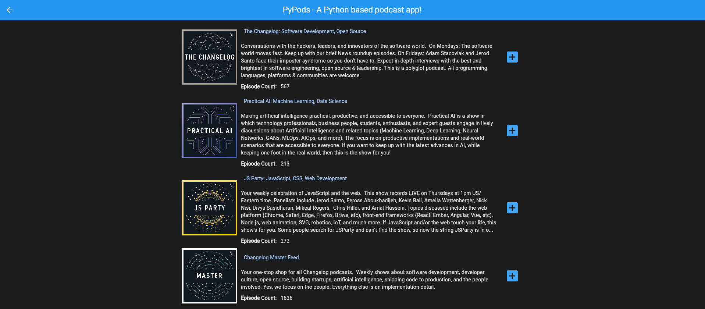

  

# PinePods

- [PinePods](#pinepods)
  - [Features](#features)
  - [Hosting](#hosting)
  - [Installing/Running](#installingrunning)
  - [ToDo](#todo)
    - [Needed pre-beta release](#needed-pre-beta-release)
    - [To be added after version 1](#to-be-added-after-version-1)
  - [Platform Availability](#platform-availability)
  - [API Notes](#api-notes)
  - [Screenshots](#screenshots)
      
PinePods is a Python based app that can sync podcasts for individual accounts that relies on a central database with a web frontend and apps available on multiple platforms

## Features
N/A

## Hosting
N/A

## Installing/Running
N/A

## ToDo

Added in order they will be completed:

 - [x] Create Code that can pull Podcasts
 - [x] Integrate Podcast Index
 - [x] Play Audio Files using Python - The python vlc package is used for this
 - [x] Record listen history and display user history on specific page
 - [x] Record accurate listen time. So if you stop listening part-way through you can resume from the same spot
 - [x] Scrubbing playback from a progress bar - ft.slider()
 - [x] Add visual progress bar based on time listened to podcasts partly listened to
 - [x] Add Download option for podcasts. In addition, display downloaded podcasts in downloads area. Allow for deletion of these after downloaded
 - [x] Add Queue, and allow podcasts to be removed from queue once added (Queue is added but you can't remove them from it yet)
 - [x] Create login screen
 - [x] Check for and remove podcasts no longer available (This will be handled from scheduled cron job that queues)
 - [x] Check user values when adding new user
 - [x] Prevent user from being added without required info 
 - [x] Prevent submit for user from being hit without populated values
 - [x] Figure out why some podcasts don't appear in search (This was because of the old podcast index python package. Rebuilt using requests and now it works great)
 - [x] Implement resume playback throughout all areas of the app
 - [x] Implement Episode view (Should be able to display html via markdown)
 - [x] Theme settings
 - [x] Fix issues with episodes playing not in database (Sorta fixed. For now episodes played are always in database. External to database episodes coming soon)
 - [x] Add picture of current episode to soundbar
 - [x] Fix issue with podcasts sometimes not registering time when played (Occured becuase of VLC not registering time. It now tries 5 times and always works)
 - [x] Implement smoother scrolling with big list loading (Mostly fixed. If there's a podcast with hundreds of episodes with loads of markdown rendered it can still cause slowdown. Moving this to the backlog.)
 - [x] Admin area for User management
 - [x] Add new user currently doesn't set admin or not. Just NULL (It now sets non admin by default)
 - [x] Make Admin options not available to standard users
 - [x] Ability to Delete Users
 - [x] Ensure there is always at least one admin user
 - [x] Allow guest user to be disabled
 - [x] Ensure changes cannot be made to guest user
 - [x] Ensure Users cannot delete themselves
 - [x] Guest sign in via button on login screen when enabled
 - [x] Episode Streaming via external web client doesn't currently work (Fixed, mostly. I now use flet audio controls to do everything)
 - [x] Implement saved episodes view
 - [x] On hover user hello
 - [x] Add caching to image server
 - [x] User self service creation
 - [x] User container click stats page
 - [x] Implement download episode checking throughout
 - [x] Implement saved episode checking throughout
 - [x] Add loading wheels throughout
 - [x] Add verification snack bars throughout 
 - [x] Finish Themes
 - [x] Remove Podcasts from search or just don't allow adding a second time (It throws a snackbar if you try and add one a second time)
 - [x] Removing a podcast currently doesn't display snackbar
 - [x] Create Web App
     - [x] More responsive layout 
     - [x] Security and Logins
     - [x] Database interaction for users and podcast data

 ### Needed pre-beta release
 - [ ] Implement sign in retention. Cookies sort of
 - [ ] Audio volume interaction (implemented but layout is still wrong)
 - [ ] Layout soundbar better (it adjusts for screensize but can overlap at times with the episode title)
 - [ ] Fully update Readme with updated info and docs including deployment guide
 - [ ] Bugs
    - [x] Links when searching an episode are blue (wrong color)
    - [x] When changing theme, then selecting 'podcasts' page, the navbar does not retain theme
    - [x] There's an issue with Queue not working properly. Sometimes it just plays instead of queues (Fixed when switching to flet audio control)
    - [x] Clicking podcast that's already been added displays add podcast view with no current way to play
    - [x] Clicking play buttons on a podcast while another is loading currently breaks things
    - [x] Pausing audio changes font color
    - [x] Login screen colors are wrong on first boot
    - [x] Themeing currently wrong on audio interaction control
    - [x] Starting a podcast results in audio bar being in phone mode on application version (This should be fixed. I load the check screensize method now further down the page. Which results in consistent width collection.)
    - [x] Starting a podcast results in audio bar being in phone mode on application version
    - [x] Adding a podcast with an emoji in the description currently appears to break it
    - [ ] The queue works but currently does not remove podcasts after switching to a new one
    - [ ] Resume is currently broken (it now works but it double plays an episode before resuming for some reason)
    - [ ] Search disappears after changing routes in the web version
    - [ ] Fix any additional browser playback bugs
    - [ ] Double and triple check all interactions to verify functionality
 - [ ] Dockerize
     - [ ] Package into Container/Dockerfile
     - [ ] Pypods image in docker hub
     - [ ] Create Docker-Compose Code
     - [ ] Option to run your own local podcast index api connection

 ### To be added after beta version

 - [ ] Allow local downloads to just download the mp3 files direct
 - [ ] Clicking new page while audio is playing restarts the podcast audio (This is confirmed a bug with flet. Waiting for fix)
 - [ ] Optimize while podcast is playing
 - [ ] No retention on guest user. Once logged out it should delete everything
 - [ ] Page refreshing to handle adding and removing of things better
 - [ ] Find a better way to handle big lists. Opening podcasts with 1000+ episodes is chaos
 - [ ] Handle Images better. Currently it takes a long time to parse through many images (Needs to not load all images. Only ones on screen)
 - [ ] Improve image caching
 - [ ] Reloaded not needed to add and remove episodes from pages
 - [ ] Customize login screen
 - [ ] Add highlight to indicate which page you're on
 - [ ] Add Itunes podcast API
 - [ ] Better queue interaction. There should be a way to drop down current queue and view without changing route
 - [ ] MFA Logins - Github integration and local MFA (OAuth)
 - [ ] GUI Wrapper for App
     - [ ] Server Hosting and client Interaction - Client interaction works via API with mariadb which is hosted on server side
     - [ ] Linux App
     - [x] Proper web layout
     - [ ] Windows App
     - [ ] Mac App
     - [ ] Android App
     - [ ] IOS App
  - [ ] Fix local images on web edition
  - [ ] Add verification before deleting user
  - [ ] Rating System
  - [ ] Sharing System

## Platform Availability

The Intention is for this app to become available on Windows, Linux, Mac, Android, and IOS. The server will be run from docker and connect to the clients on these platforms

## API Notes

Coming soon

## Screenshots

  

